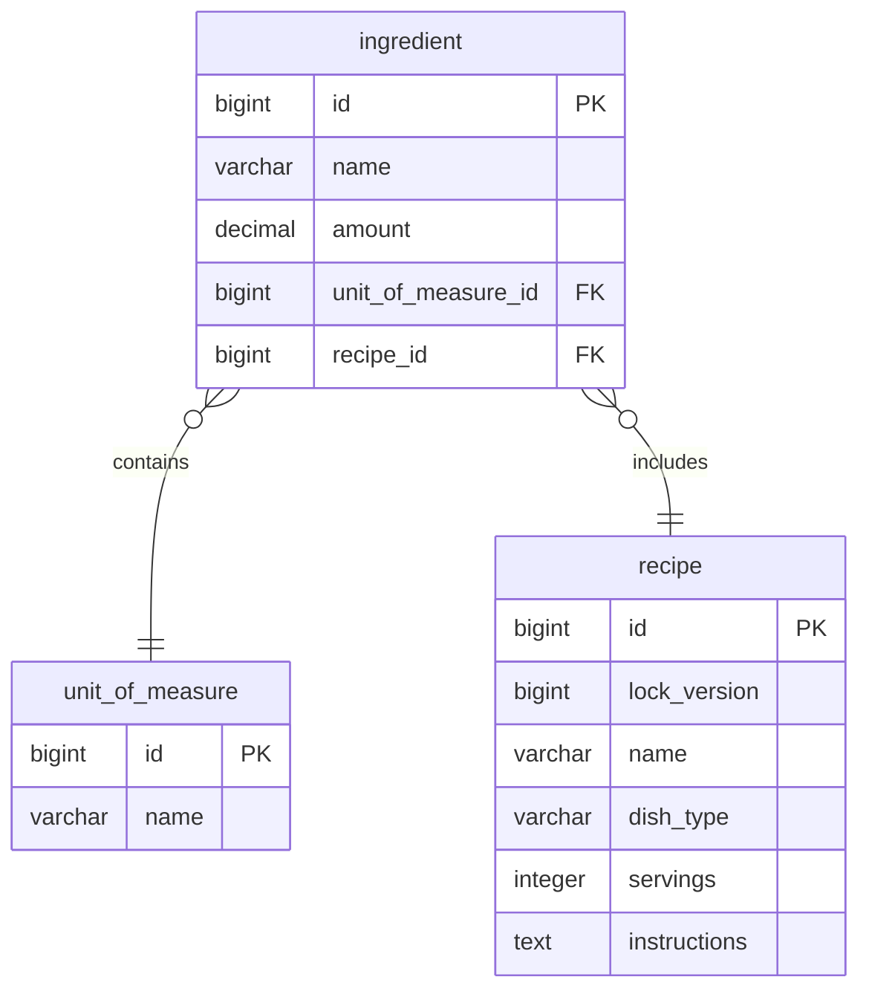

# Recipe Microservice

This microservice manages recipes for a food application.

## Table of Contents

- [Architecture Overview](#architecture-overview)
- [API Design](#api-design)
- [Security](#security)
- [Data Management](#data-management)
- [Error Handling](#error-handling)
- [Deployment](#deployment)
- [How to Run](#how-to-run)
- [How to Test](#how-to-test)

## Architecture Overview

This service is built using a microservice architecture to allow for independent scaling and deployment.

**Technology Stack:**

- **Backend:**
    - Spring Boot 3.4.4: Framework for building Java applications.
    - Java 21: The programming language used for the service.
- **Database:**
    - PostgreSQL DB: Relational database used for data storage.
    - Flyway: Tool for managing database migrations.
    - TestContainers: Library for running Docker containers in integration tests.
- **Containerization:**
    - Docker: Platform for containerizing the application.
    - Docker Compose: Tool to define and run multi-container Docker applications.
- **API:**
    - OpenAPI: Specification for designing and documenting APIs.
    - Mapstruct: Library for mapping between Java beans (DTOs).

## API Design

The following endpoints are available:

- `GET /v1/units`: Retrieves all units of measure used by ingredients.
- `GET /v1/dish-types`: Retrieves all dish types used by recipes.
- `POST /v1/recipe`: Add recipe
- `GET /v1/recipe/{recipeId}`: Retrieves a recipe given its ID
- `GET /v1/recipe`: Retrieves recipes by filetering by multiple parameters like dishType, dishTypeIsIncluded, servings, ingredients, ingredientsIsIncluded, and instructionsContains. There are also parameters to handle pagination like page, page_size, and to sort by a given field name.

**API Docs**

The API specification is available in OpenAPI format via Swagger UI: 

[http://localhost:8080/swagger-ui/index.html](http://localhost:8080/swagger-ui/index.html)


## Security

**Note:** This service currently does not implement any client authentication or authorization mechanisms (e.g., JWT, API Key). All endpoints are publicly accessible.

**Future Considerations:**

* Implement JWT-based authentication for secure client access.
* Consider role-based access control (RBAC) to restrict access to certain endpoints.
* Explore API Key authentication for external clients.


## Data Management

This service uses PostgreSQL as its database. 

Flyway is used for database migrations, ensuring consistent schema updates. 

Mapstruct handles the mapping between database entities and DTOs. 

TestContainers is used to run the integration tests using a docker container postgresql databases.


**Database Model**




## Error Handling

This microservice employs a centralized error handling mechanism to provide consistent and informative error responses to clients. The `ErrorHandler` class, annotated with `@ControllerAdvice`, intercepts exceptions and translates them into standardized `ErrorDto` object, which are then returned in the HTTP response body.

**General Principles:**

* **Consistent Format:** All error responses adhere to a uniform `ErrorDto` structure, containing `title`, `status` (HTTP status code), and `detail` (error message or description).
* **Logging:** Errors are logged using SLF4J for debugging and monitoring purposes.
* **Specific Exceptions:** The handler covers a range of specific exceptions to provide tailored error messages.

**ErrorDto Structure:**

```json
{
    "title": "Error Title",
    "status": 400,
    "detail": "Error details"
}
```

**Security Related Errors:**

* Currently, there are no security related errors, as the service does not implement authentication or authorization.


## Deployment

This service is containerized using Docker. 

The `recipe-service/docker-compose.yaml` file defines the service and its dependencies. 

Environment variables are used to configure the database connection.
The environment variables are placed in the file `recipe-service/.env`, a file used by docker compose to set environment variables. 

The following environment variables are used to configure the database connection:

- POSTGRES_DB: The name of the PostgreSQL database.
- POSTGRES_USER: The PostgreSQL username.
- POSTGRES_PASSWORD: The PostgreSQL password.
- SPRING_DATASOURCE_URL: The JDBC URL for the PostgreSQL database connection.
- SPRING_DATASOURCE_USERNAME: The username used by Spring Boot to connect to the database.
- SPRING_DATASOURCE_PASSWORD: The password used by Spring Boot to connect to the database.


## How to Run

Requirements:

To run this application, ensure you have the following installed:

- Java 21
- Maven 3.9.9
- Docker

Also, make sure the following ports are available:

- 8080
- 5432

**Steps to run the app**

1. Go to directory: **recipe-spec**
2. Run the command: `mvn clean package`
3. Run the command: `mvn install:install-file -Dfile=target/recipe-spec-1.0.0.jar -DgroupId=abn -DartifactId=recipe-spec -Dversion=1.0.0 -Dpackaging=jar`
4. Go to directory: **recipe-service**
5. Run the command: `mvn clean package`
6. Run the command: `docker-compose build --no-cache`
7. Run the command: `docker-compose up`


## How to Test

- You can test the service by importing the following file into Postman: 

**recipe-postman/Recipe.postman_collection.json**

