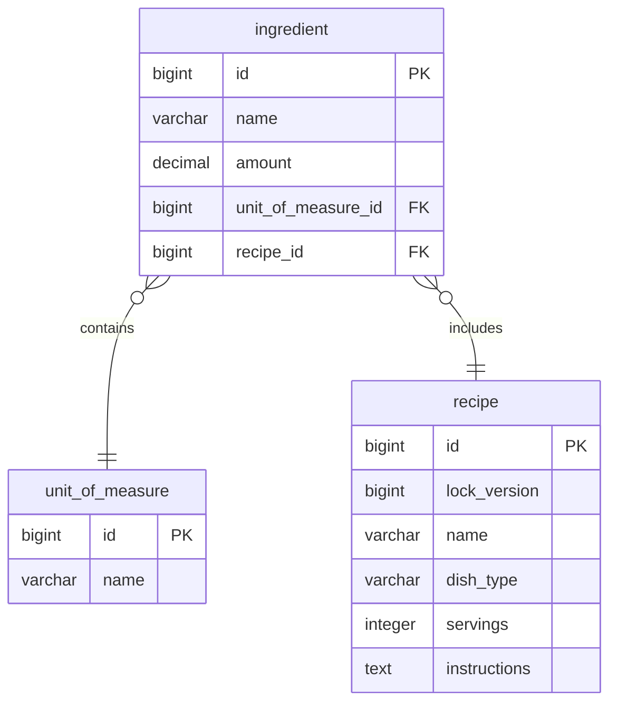

# Recipe Microservice

This microservice manages recipes for a food application.

## Table of Contents

- [Architecture Overview](#architecture-overview)
- [API Design](#api-design)
- [Data Management](#data-management)
- [Deployment](#deployment)
- [How to Run](#how-to-run)

## Architecture Overview

This service is built using a microservice architecture to allow for independent scaling and deployment.

**Technology Stack:**

- Spring Boot 3.4.4
- Java 21
- PostgreSQL DB
- Docker
- OpenAPI
- Flyway
- Mapstruct
- TestContainers

## API Design

The following endpoints are available:

- `GET /v1/units`: Retrieves all units of measure used by ingredients.
- `GET /v1/dish-types`: Retrieves all dish types used by recipes.
- `POST /v1/recipe`: Add recipe
- `GET /v1/recipe/{recipeId}`: Retrieves a recipe given its ID
- `GET /v1/recipe`: Retrieves recipes by filetering by multiple parameters like dishType, dishTypeIsIncluded, servings, ingredients, ingredientsIsIncluded, and instructionsContains. There are also parameters to handle pagination like page, page_size, and to sort by a given field name.

**For greater detail of API Spec, please run the app and check the API Spec document in the following URL:**

- http://localhost:8080/swagger-ui/index.html

## Data Management

This service uses PostgreSQL as its database. 

Flyway is used for database migrations, ensuring consistent schema updates. 

Mapstruct handles the mapping between database entities and DTOs. 

TestContainers is used to create test databases.

## Database Model

## Deployment

This service is containerized using Docker. The `docker-compose.yaml` file defines the service and its dependencies. 

Environment variables are used to configure the database connection.

## How to Run

Requirements:

Make sure the installation of:

Java 21
Maven 3.9.9
Docker

Make sure the following ports are free:

- 8080
- 5432

Make sure the existence of the file: recipe-service/.env

Steps to run the app:

1. Go to directory: recipe-spec
2. Run the command: mvn clean package
3. Run the command: mvn install:install-file -Dfile=target/recipe-spec-1.0.0.jar -DgroupId=abn -DartifactId=recipe-spec -Dversion=1.0.0 -Dpackaging=jar
4. Go to directory: recipe-service
5. Run the command: mvn clean package
6. Run the command: docker-compose build --no-cache
7. Run the command: docker-compose up
8. For testing the app use Postman and import the file: recipe-docs/Recipe.postman_collection.json

